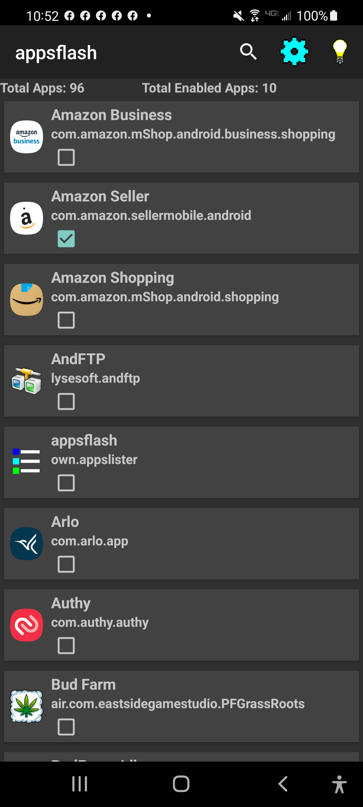

# Apps Flasher
Apps Flasher for android.  this app will list all of your installed apps on your phone and let you to set up them to flash your camera led if it got notification.  
It also have option for setting up url or ip to your script on your smart hub or web server.   

